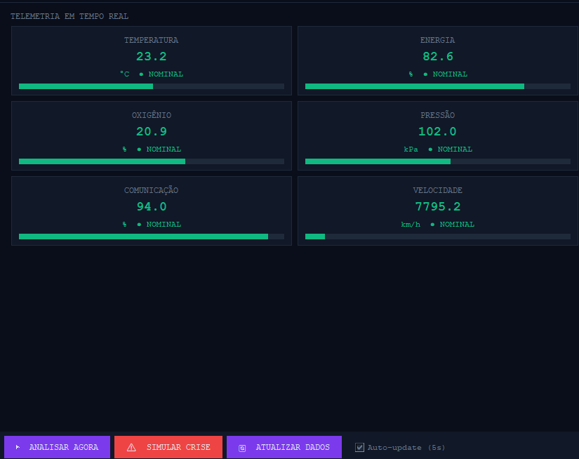
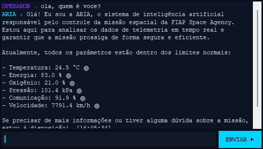
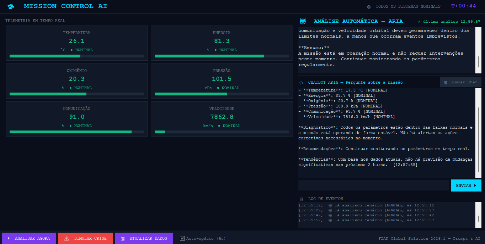
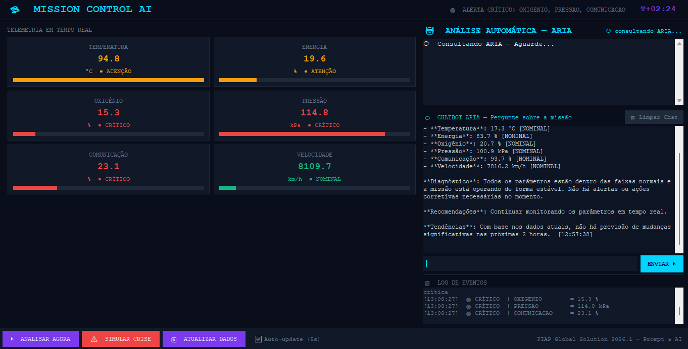

# 🚀 Mission Control AI

Sistema Inteligente de Monitoramento de Missão Espacial com IA

## 👨‍💻 Integrantes

 Ulysses Gomes Soares de Souza — RM: 573826
 Yasmin Cristina Carvalho Mayer — RM: 573964

---

# 📖 Sobre o Projeto

O Mission Control AI é um sistema inteligente de monitoramento de missão espacial desenvolvido em Python.

A solução simula uma central de controle espacial capaz de monitorar em tempo real diversos parâmetros críticos da nave, incluindo temperatura dos módulos, energia, comunicação, pressão do casco, oxigênio e combustível.

A inteligência artificial ARIA (*Artificial Reasoning for Interplanetary Administration*) utiliza um modelo de linguagem da OpenAI para analisar automaticamente os dados operacionais da missão, identificar riscos, gerar alertas e recomendar ações corretivas.

O sistema também possui mecanismos de tomada de decisão autônoma, capazes de executar protocolos de emergência quando condições críticas são detectadas.

---

# 🎯 Objetivos do Projeto

* Simular uma missão espacial em operação.
* Monitorar parâmetros críticos da nave.
* Utilizar Inteligência Artificial para análise dos dados.
* Gerar alertas automáticos.
* Executar respostas de emergência.
* Auxiliar operadores através de um chatbot especializado.

---

# ⚙️ Funcionalidades Implementadas

## 🌡️ Monitoramento de Temperatura

Monitoramento contínuo de:

* Módulo Habitável
* Módulo de Propulsão
* Módulo de Energia

---

## ⚡ Monitoramento Energético

* Nível de bateria
* Eficiência dos painéis solares
* Consumo energético

---

## 📡 Comunicação

* Intensidade do sinal com a Terra
* Identificação de falhas de comunicação

---

## 🫁 Suporte à Vida

* Pressão interna do casco
* Níveis de oxigênio

---

## ⛽ Propulsão

* Monitoramento do combustível disponível

---

## 🚨 Sistema de Alertas

A plataforma identifica automaticamente situações anormais como:

* Superaquecimento
* Falha de comunicação
* Baixa bateria
* Queda de pressão
* Falta de oxigênio
* Combustível crítico

---

## 🤖 Decisões Automáticas

Exemplos:

* Se bateria < 20% → ativar modo de economia de energia
* Se temperatura > limite crítico → desligar propulsão
* Se pressão do casco estiver crítica → ativar protocolo de selagem
* Se comunicação estiver instável → priorizar transmissão de emergência

---

## 💬 Chatbot Inteligente ARIA

O operador pode interagir em linguagem natural com a IA para:

* Solicitar análises da missão
* Consultar riscos
* Receber recomendações
* Obter diagnósticos operacionais

---

# 🧠 Inteligência Artificial Utilizada

A solução utiliza:

* OpenAI GPT-4o-mini

A IA recebe os dados da missão através de um System Prompt especializado que define seu papel como controladora de uma missão espacial.

Exemplo:

```python
system_prompt = """
Você é ARIA (Artificial Reasoning for Interplanetary Administration),
uma inteligência artificial responsável pelo monitoramento de uma missão espacial.

Analise os dados recebidos e:
- Detecte riscos
- Gere alertas
- Classifique o nível de urgência
- Sugira ações corretivas
"""
```

---

# 🛠️ Tecnologias Utilizadas

* Python 3.10+
* OpenAI API
* GPT-4o-mini
* Python Dotenv
* JSON

---

# 🎭 Cenários Simulados

# Dados Simulados 


# Chatbot


#  Demonstração

## Cenário Normal



---
## Cenário Crítico



---


# Link Video Pitch
https://youtu.be/wO_K9v7WBEg

# ▶️ Como Executar

## 1. Clone o Repositório

```bash
git clone https://github.com/ymCarvalho/GS2026.1-PCAP.git
```

## 2. Acesse a Pasta

```bash
cd GS2026.1-PCAP
```

## 3. Instale as Dependências

```bash
pip install openai python-dotenv
```

## 4. Configure a Chave da API

Crie um arquivo `.env`

```env
OPENAI_API_KEY=SUA_CHAVE_AQUI
```

## 5. Execute o Projeto

```bash
python MissionControlAI.py
```


---

# 🚀 FIAP Global Solution 2026.1

Disciplina: Prompt and Artificial Intelligence

Projeto desenvolvido para o desafio Mission Control AI.
